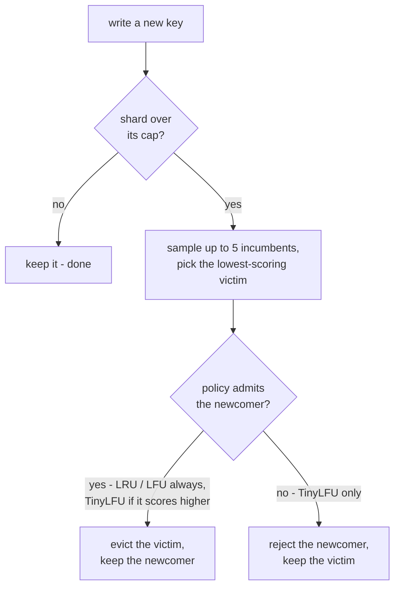

# The store

The store is kyria's single-node engine: a concurrency-safe map from string keys
to opaque byte-slice values, with optional TTLs and eviction.

## The layered design

There are two implementations of the `Store` interface, one wrapping the other:

- **`MapStore`** ([map_store.go](../internal/store/map_store.go)) is a plain Go map
  with size limits and eviction. It is **deliberately not safe for concurrent use**, 
  as its methods take no locks.
- **`ShardedStore`** ([sharded_store.go](../internal/store/sharded_store.go)) is the
  concurrency-safe implementation every caller actually uses. 
  It holds a fixed set of `MapStore` shards, each behind its own lock.

Keeping `MapStore` unsynchronised means the locking lives in the sharding layer
instead of being smeared across every method of both types. 
A `ShardedStore` with a single shard is then just a plain map behind one global lock.

## Concurrency: lock striping

A single mutex over one big map would serialise every operation, as two clients
touching unrelated keys would still queue behind each other. Lock striping removes
that contention because the keyspace is partitioned across N shards, each independently
locked, so operations on keys in different shards run in parallel.

A key maps to a shard by hashing it (`maphash`, seeded once at construction) modulo
the shard count. The mapping is fixed for the store's lifetime, since the seed and the
shard count never change during runtime. This means a key always resolves to the 
same shard, and therefore the same lock. 
Reads take a read lock (many can proceed at once); 
Writes take the write lock for that one shard only.

Contention falls as you add shards up to a certain point. Past the number of cores doing
concurrent work there is nothing left to parallelise.

## Key expiration

A key can be written with a TTL. Expiry then happens two ways:

- **Lazily, on read**. `Get` checks the expiry and reports an expired entry as absent.
  Reads are consistent, but they never free memory.
- **Actively, by the janitor** ([janitor.go](../internal/store/janitor.go)). A
  background goroutine sweeps every shard on a fixed interval and deletes whatever has
  expired, reclaiming the memory lazy expiry leaves behind.

## Eviction: cap, sample, admit

Eviction is optional(off by default). When on, it is governed by a **per-shard**
entry cap. This mean the global ceiling is roughly `max-entries x shards`.

When a write pushes a shard over its cap, the store must remove one entry to get back
under. That decision comes down to two questions:

1. **Which incumbent is the weakest?** - victim selection.
2. **Is the newcomer even worth keeping over that victim?** - admission.

**Victim selection is sampled, not exhaustive.** Scanning every entry to find the
true minimum would make eviction O(n); instead the store inspects a handful (5) and
takes the weakest of those. Go's map iteration is randomised, so those 5 are a random
sample — the same approximation Redis uses. It is not the globally weakest entry, but
over many evictions it is close enough, at constant cost.

**Admission is where the policies differ.** Plain LRU and LFU always admit: the
newcomer displaces the sampled victim, no questions asked. TinyLFU can *refuse* admission
if the newcomer looks less popular than the victim it would evict. In this situation
keeping the newcomer would be a bad trade, so the newcomer is dropped instead. 
One particularity, is that replicated writes in the cluster mus bypass admission
because a replica is not deciding whether a key is *worth* caching, it is being *told* to hold it.

### The policies

All three implement one `Policy` interface ([policy.go](../internal/store/policy.go)).
Each entry carries a small atomic counter, a "hint", that the policy maintains. 
That hint is turned into a score where the lowest score is evicted first.
The policy is touched from `Get` under a *read* lock, so it may only mutate
atomic state, never the map. That constraint is what keeps reads lock-free.

- **LRU** stamps each touched entry with a monotonic clock tick. The smallest stamp is
  the least-recently-used entry. Approximate, because victim selection is sampled.
- **LFU** counts accesses; the smallest count is the least-frequently-used. It has two
  well-known flaws, both of which TinyLFU fixes: a **cold-start** problem (a brand-new
  key starts at the floor, so it is the immediate eviction candidate and struggles to
  get established) and **no aging** (counts only grow, so a key that was hot hours ago
  never loses its lead).
- **TinyLFU** solves both by taking its frequency numbers from a shared, self-aging
  count-min sketch, and by using them to *admit* rather than just to rank.

### The count-min sketch

TinyLFU needs a popularity estimate for *any* key, including a brand-new one it has
never stored.
The count-min sketch ([sketch.go](../internal/store/sketch.go)) gives an approximate 
frequency for any key in fixed memory, without storing the keys at all.

It is a grid of tiny 4-bit counters with 4 rows by a power-of-two width. To record a key,
hash it once, split the hash into two halves, and use double hashing to pick one column
per row; increment those four counters (saturating at 15). To estimate a key's
frequency, read the same four counters and take the **minimum**.

Different keys can collide on a counter, but a collision can only ever push a counter 
*higher* than the true count, never lower. So the smallest of a key's four counters is the 
one least polluted by collisions, and therefore the most trustworthy estimate. 

It also has **self aging**. Once the total number of records reaches a threshold
(`10 x capacity`), every counter is halved in one pass. This means hot keys can fade instead
of holding its lead forever.